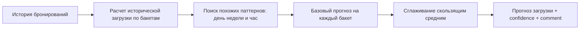
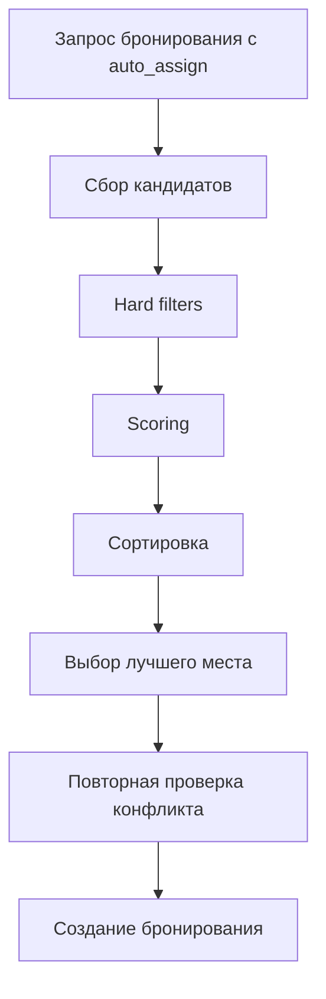
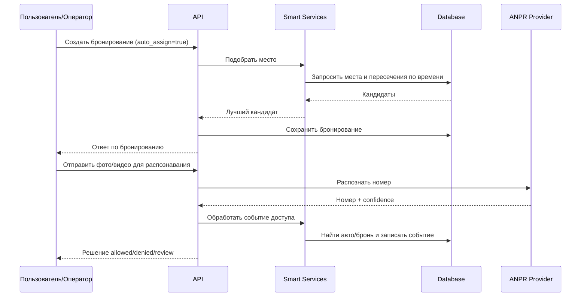

# Умная часть проекта: архитектура, метрики, прогнозирование и распознавание номеров

## 1. Краткое описание
Интеллектуальная часть системы помогает принимать решения в трех основных процессах:
- анализ загрузки парковки и поведения бронирований;
- прогноз будущей загрузки;
- автоматическое назначение места и контроль доступа по номеру автомобиля.

На практике это означает, что система не только хранит бронирования, но и рассчитывает показатели, строит прогнозы по историческим данным, выбирает подходящее место при `auto_assign=true` и обрабатывает события въезда/выезда через распознавание номера.

## 2. Общая архитектура
Ниже показано, как связаны пользовательские запросы, сервисы «умной» логики и база данных.

```mermaid
flowchart TD
    U[Пользователь или оператор] --> API[API: bookings / analytics / access-events]

    API --> REC[Сервис подбора места]
    API --> AN[Сервис аналитики и прогноза]
    API --> ANPR[Сервис распознавания номера]

    REC --> DB[(База данных)]
    AN --> DB
    ANPR --> DB

    ANPR --> PROVIDER[Runoi provider (YOLO + CRNN)]
    ANPR --> FALLBACK[Fallback provider]

    AN --> MREC[Сервис управленческих рекомендаций]
    MREC --> AD[Сервис поиска аномалий]
    AD --> DB
```

Основные модули:
- `app/services/analytics.py` — метрики и прогноз;
- `app/services/recommendations.py` — автоподбор и ранжирование мест;
- `app/services/plate_recognition_pipeline.py` и `app/services/anpr/providers/runoi_provider.py` — ANPR-пайплайн;
- `app/services/access_events.py` — решение `allowed/denied/review` по событию доступа.

## 3. Источники данных

| Источник данных | Где используется | Важные поля | Комментарий |
|---|---|---|---|
| `bookings` | Метрики, прогноз, подбор места, поиск связанного бронирования | `start_time`, `end_time`, `status`, `parking_spot_id`, `vehicle_id`, `plate_number` | Основной источник по занятости и спросу |
| `parking_spots` | Подбор места, расчеты загрузки | `status`, `spot_type`, `zone_id`, `has_charger`, `vehicle_type`, `size_category` | Определяет доступный набор мест |
| `parking_zones` | Зональная аналитика и ограничения доступа | `name`, `access_level` | Используется в аналитике по зонам и доступе по ролям |
| `vehicles` | Связка распознанного номера с автомобилем и пользователем | `plate_number`, `normalized_plate_number`, `is_active`, `user_id` | Поиск автомобиля по номеру |
| `vehicle_access_events` | История въездов/выездов и решений | `normalized_plate_number`, `decision`, `recognition_confidence`, `processing_status` | Фиксирует результат контроля доступа |
| `audit_logs` | Выявление событий с неизвестными номерами | `action_type`, `new_values`, `source_metadata` | Используется в аномалиях и рекомендациях |

## 4. Вычисление метрик
Раздел описывает основные метрики из `app/services/analytics.py` и их применение в API `app/api/v1/endpoints/analytics.py`.

### 4.1 Процент занятости парковки (Occupancy Percent)
Эта метрика показывает, какая доля доступного времени всех мест была занята в выбранный период.

Формула:

$$
OccupancyPercent = \frac{OccupiedTime}{TotalAvailableTime} \times 100
$$

Где:

| Переменная | Значение |
|---|---|
| `OccupiedTime` | Суммарное время занятости мест внутри выбранного интервала |
| `TotalAvailableTime` | Общее доступное время всех мест: `N_spots × длительность интервала` |

Как считается пересечение интервалов:
- Система берет период анализа, например `10:00–11:00`.
- Для каждого бронирования учитывается только часть, попадающая в этот период.
- Пример: бронирование `10:30–11:30` дает в расчет только `10:30–11:00` (30 минут).

Ниже схема этого пересечения.

```mermaid
gantt
    title Пример пересечения бронирования с периодом анализа
    dateFormat HH:mm
    axisFormat %H:%M

    section Период анализа
    Анализируемый интервал :a1, 10:00, 60m

    section Бронирование
    Полное бронирование :b1, 10:30, 60m
    Часть, попавшая в расчет :crit, b2, 10:30, 30m
```



Пример расчета:
- В парковке 10 мест.
- Период анализа: 1 час = 60 минут.
- Общее доступное время: `10 × 60 = 600` минут.
- Суммарная занятость в этом часу: 300 минут.
- `OccupancyPercent = 300 / 600 × 100 = 50%`.

Где используется:
- сводная аналитика (`/analytics/summary`);
- детальная аналитика загрузки (`/analytics/occupancy`);
- управленческие рекомендации.

### 4.2 Доля отмен (Cancellation Rate)
Показывает долю бронирований со статусом `cancelled`.

Формула:

```text
cancellation_rate = cancelled_bookings / total_bookings
```

Где:
- `cancelled_bookings` — количество отмененных бронирований;
- `total_bookings` — общее количество бронирований в периоде.

Пример:
- Всего 100 бронирований, из них 18 отменены.
- `cancellation_rate = 18 / 100 = 0.18 = 18%`.

Где используется:
- в метриках бронирований;
- в правилах аномалий и управленческих рекомендациях.

### 4.3 Доля неявок (No-show Rate)
`No-show` — это бронирование со статусом `no_show`, когда пользователь не приехал.

Формула:

```text
no_show_rate = no_show_bookings / total_bookings
```

Пример:
- Всего 80 бронирований, 12 со статусом `no_show`.
- `no_show_rate = 12 / 80 = 0.15 = 15%`.

Практический смысл:
- помогает понять, какая часть мест была «зарезервирована на бумаге», но не использована фактически;
- применяется в аналитике и управленческих сигналах.

### 4.4 Средняя длительность бронирования (Average Booking Duration)
Показывает, сколько в среднем длится одно бронирование.

Формула:

$$
AverageDuration = \frac{\sum (end\_time - start\_time)}{TotalBookings}
$$

Пример:
- Длительности: 30, 60 и 90 минут.
- `AverageDuration = (30+60+90)/3 = 60 минут`.

Где используется:
- в аналитике бронирований;
- в проверках аномалий длительности.

### 4.5 Пиковые часы (Peak Hours)
Система группирует бронирования по часу **начала** (`start_time`) и считает, в какие часы стартует больше всего бронирований.

Пример:
- в 09:00 началось 12 бронирований;
- в 10:00 — 7;
- в 18:00 — 15.

Значит, 18:00 — один из пиковых часов спроса.

### 4.6 Таблица метрик

| Метрика | Что показывает | Как считается | Где используется |
|---|---|---|---|
| Процент занятости (`occupancy_percent`) | Среднюю загрузку парковки за период | Учет реального времени занятости мест внутри интервала | `/analytics/summary`, `/analytics/occupancy`, рекомендации |
| Доля отмен (`cancellation_rate`) | Долю отмененных бронирований | `cancelled / total` | Аналитика, аномалии, рекомендации |
| Доля неявок (`no_show_rate`) | Долю бронирований, где пользователь не приехал | `no_show / total` | Аналитика, аномалии, рекомендации |
| Средняя длительность | Среднее время одного бронирования | Среднее по `(end_time - start_time)` | Аналитика, аномалии |
| Пиковые часы | Часы максимального спроса | Группировка по часу начала бронирования | Отчеты и операционные решения |

## 5. Прогнозирование
Прогноз строится статистическим способом в `HistoricalPatternForecastModel`.

Простыми словами:
1. Система берет историю бронирований за прошлые дни.
2. Переводит историю в проценты занятости по временным бакетам (например, по 1 часу).
3. Ищет похожие исторические ситуации по дню недели и часу.
4. Формирует прогноз на целевой период.
5. Применяет сглаживание, чтобы убрать резкие случайные колебания.

Ниже схема этого конвейера.



### 5.1 Что означают исторические паттерны
- **Global average** — общий средний уровень загрузки по всей доступной истории.
- **Weekday average** — средняя загрузка для конкретного дня недели (например, все понедельники).
- **Hour average** — средняя загрузка для конкретного часа (например, все интервалы 09:00–10:00).
- **Weekday + hour average** — самый точный исторический срез: например, «понедельник, 09:00».

Пример:
- В прошлые понедельники в 09:00 загрузка была 68%, 72%, 70%.
- Среднее по этому срезу: 70%.
- Это значение используется как сильный сигнал для прогноза ближайшего понедельника в 09:00.

### 5.2 Сглаживание SMA (Simple Moving Average)
Скользящее среднее помогает сделать прогноз более плавным.

Пример:
- исходные значения: `40%, 80%, 50%`;
- среднее: `(40+80+50)/3 = 56.7%`.

После сглаживания прогноз меньше реагирует на единичный резкий скачок.

### 5.3 Качество прогноза
Для оценки качества используется endpoint `/analytics/forecast-quality`.

Возвращаются:
- `MAE`;
- `MAPE`;
- `RMSE`;
- `comparison_series` (пары факт/прогноз по временным точкам).

## 6. Автоподбор места для бронирования
Автоподбор включается при `auto_assign=true` в создании бронирования.

Пошаговая логика:
1. Пользователь отправляет запрос на бронирование.
2. Система собирает потенциальные места в выбранной парковке.
3. Применяет жесткие фильтры (hard filters).
4. Для оставшихся мест считает итоговый балл (score).
5. Сортирует кандидатов по score.
6. Выбирает лучший вариант.
7. Перед сохранением повторно проверяет конфликт по времени.

Ниже показан общий поток выбора.



### 6.1 Hard filters
Кандидат исключается, если:
- место имеет статус `blocked`;
- есть пересечение с блокирующим бронированием в нужный интервал;
- место недоступно для роли пользователя по правилам доступа;
- в режиме строгого предпочтения зарядки место без зарядки;
- дополнительные фильтры запроса не совпадают (тип места, зона, тип ТС, размер и др.).

### 6.2 Формула оценки парковочного места
Каждое подходящее место получает итоговый балл.

$$
Score =
Availability \times W_{availability} +
SpotType \times W_{spotType} +
Zone \times W_{zone} +
Charger \times W_{charger} +
Role \times W_{role} +
Conflict \times W_{conflict}
$$

Каждый фактор нормирован в диапазоне от 0 до 1.

| Фактор | Что означает |
|---|---|
| `Availability` | Насколько место доступно для бронирования |
| `SpotType` | Насколько тип места соответствует предпочтениям |
| `Zone` | Насколько зона подходит под запрос |
| `Charger` | Подходит ли место по наличию зарядки |
| `Role` | Разрешено ли место для роли пользователя |
| `Conflict` | Насколько мало рядом по времени соседних конфликтов |

Веса по умолчанию:
- `W_availability = 0.35`
- `W_spotType = 0.15`
- `W_zone = 0.10`
- `W_charger = 0.10`
- `W_role = 0.20`
- `W_conflict = 0.10`

Вес показывает влияние фактора на итоговый балл. Чем больше вес, тем сильнее фактор влияет на выбор.

Пример расчета:

```text
Availability = 1.0
SpotType = 0.8
Zone = 0.5
Charger = 1.0
Role = 1.0
Conflict = 0.7

Score =
1.0*0.35 + 0.8*0.15 + 0.5*0.10 + 1.0*0.10 + 1.0*0.20 + 0.7*0.10
      = 0.35 + 0.12 + 0.05 + 0.10 + 0.20 + 0.07
      = 0.89
```

Чем ближе значение score к 1, тем лучше место соответствует текущему запросу.

## 7. Распознавание номеров автомобилей
Распознавание используется в endpoints `access-events/recognize/*`.

Процесс начинается с получения изображения или видео, затем система извлекает номер, нормализует его и принимает решение по доступу.

```mermaid
flowchart LR
    A[Фото или видео] --> B[Предобработка изображения]
    B --> C[Поиск области номера (YOLO)]
    C --> D[OCR распознавание текста (CRNN)]
    D --> E[Нормализация номера]
    E --> F[Проверка confidence]
    F --> G[Поиск авто и бронирования]
    G --> H[Решение: allowed / denied / review]
```

### 7.1 Пояснение ключевых терминов
- **YOLO**: модель для поиска области номера на изображении. На выходе дает координаты прямоугольника, где, вероятно, находится номер.
- **CRNN**: модель для чтения символов внутри найденной области номера.
- **OCR**: преобразование изображения текста в строку.
- **Confidence**: оценка уверенности распознавания. Если значение ниже порога, событие уходит на ручную проверку.

### 7.2 Нормализация номера
Нормализация нужна, чтобы привести номер к единому виду для поиска в базе.

Что делает функция нормализации:
1. переводит символы в верхний регистр;
2. убирает пробелы и дефисы;
3. заменяет похожие кириллические символы на латинские (`А→A`, `В→B`, `С→C` и т.д.);
4. оставляет только буквенно-цифровые символы.

Пример:

```text
Исходный номер: а 123 вс 77
После нормализации: A123BC77
```

В текущем коде явная проверка формата номера через регулярное выражение не используется. Номер приводится к единому виду через нормализацию.

### 7.3 Решение по событию доступа
После распознавания система связывает номер с автомобилем и бронированием, затем выбирает одно из решений:
- `allowed` — доступ разрешен;
- `denied` — доступ запрещен;
- `review` — нужна ручная проверка.

Типовые правила:
- если номер `UNKNOWN` или confidence ниже порога — `review`;
- при въезде без связанного подходящего бронирования — `review`;
- при выезде без активного бронирования — `denied`.

## 8. Математический аппарат простыми словами

### 8.1 Учет занятости по времени
Идея: считать не количество бронирований, а время реальной занятости мест в анализируемом интервале.

Это позволяет корректно учитывать частичные пересечения интервалов и получать более точную загрузку.

### 8.2 Взвешенная оценка места
Идея: каждое место получает балл как сумму факторов с весами.

Если для текущего запроса важнее доступность, ее вес больше. Если важнее зарядка, этот фактор может сильнее повлиять при соответствующих настройках запроса.

### 8.3 Прогноз по историческим данным
Идея: использовать повторяемость паттернов спроса.

Система сравнивает похожие дни/часы из прошлого и строит ожидаемую загрузку на будущие временные бакеты.

### 8.4 Метрики ошибки прогноза
- **MAE** (Mean Absolute Error): средняя абсолютная ошибка прогноза.
  - Если `MAE = 8`, это означает, что в среднем ошибка составляет 8 процентных пунктов загрузки.
- **MAPE** (Mean Absolute Percentage Error): средняя ошибка в процентах относительно фактического значения.
- **RMSE** (Root Mean Squared Error): метрика, которая сильнее реагирует на большие промахи прогноза.

## 9. Потоки данных
Диаграмма показывает два типовых потока: автоподбор при бронировании и обработку события распознавания номера.



## 10. Обработка типовых ситуаций

| Ситуация | Как обнаруживается | Что делает система | Где реализовано |
|---|---|---|---|
| Нет подходящих мест для `auto_assign` | После фильтров/скоринга нет кандидатов | Возвращает ошибку 409 | `bookings.py`, `recommendations.py` |
| Некорректный период (`from >= to`) | Проверка входных параметров | Возвращает 400 | endpoints `analytics` и `bookings` |
| Недостаточно истории для прогноза | В истории нет данных по местам/бронированиям | Возвращает прогноз с низкой уверенностью и/или нулями | `HistoricalPatternForecastModel.predict` |
| Номер не распознан (`UNKNOWN`) | Результат распознавания | Статус `review` | `access_events.py` |
| Низкий confidence | `confidence < settings.anpr_confidence_threshold` | Статус `review` | `access_events.py` |
| Выезд без активного бронирования | Нет подходящего `active` бронирования | Статус `denied` | `access_events.py` |
| Провайдер ANPR недоступен | Ошибка инициализации/запуска провайдера | Переход на fallback provider | `plate_recognition_pipeline.py` |

## 11. Где находится код

| Файл / модуль | Назначение | Ключевые функции / классы |
|---|---|---|
| `app/services/analytics.py` | Метрики, прогноз и оценка качества прогноза | `get_occupancy_percent`, `get_booking_metrics`, `HistoricalPatternForecastModel`, `get_forecast_quality` |
| `app/services/recommendations.py` | Подбор и ранжирование мест | `recommend_spots`, `pick_best_spot_for_booking` |
| `app/api/v1/endpoints/bookings.py` | Создание бронирования и запуск `auto_assign` | `create_booking` |
| `app/services/access_events.py` | Логика решения по доступу | `process_recognition_access_event`, `process_access_event` |
| `app/services/plate_recognition_pipeline.py` | Оркестрация провайдеров распознавания | `recognize_from_image`, `recognize_from_video`, `build_diagnostics` |
| `app/services/anpr/providers/runoi_provider.py` | Детекция номера и OCR через YOLO/CRNN | `RunoiANPRProvider` |
| `app/services/plate_recognition.py` | Нормализация номера | `normalize_plate_number` |
| `app/services/anomaly_detection.py` | Выявление аномалий по правилам | `AnomalyDetectionService.detect` |
| `app/services/management_recommendations.py` | Формирование управленческих рекомендаций | `ManagementRecommendationsService.list_recommendations` |
| `app/api/v1/endpoints/analytics.py` | API метрик и прогноза | `analytics_summary`, `analytics_occupancy`, `analytics_occupancy_forecast`, `analytics_forecast_quality` |
| `app/api/v1/endpoints/access_events.py` | API распознавания и событий доступа | `recognize_access_event_image`, `recognize_access_event_video`, `manual_access_event` |

## 12. Примеры сценариев
### Сценарий 1: Автоматический подбор места
1. Пользователь создает бронирование с `auto_assign=true`.
2. Сервис подбора формирует кандидатов по парковке и фильтрам.
3. Неподходящие места отбрасываются hard filters.
4. Оставшиеся кандидаты получают score.
5. Выбирается место с лучшим баллом.
6. Перед записью выполняется повторная проверка пересечения.
7. Бронирование сохраняется.

### Сценарий 2: Распознавание номера автомобиля
1. Оператор отправляет фото или видео.
2. Пайплайн выполняет детекцию области номера и OCR.
3. Полученный текст нормализуется.
4. Система ищет связанный автомобиль и бронирование.
5. Формируется решение `allowed`, `denied` или `review`.
6. Событие сохраняется в `vehicle_access_events`.

### Сценарий 3: Расчет метрик
1. Клиент вызывает `/analytics/summary` или `/analytics/occupancy`.
2. Система определяет период анализа.
3. Считает загрузку, количество бронирований, доли отмен и неявок, длительность.
4. Возвращает готовые показатели для UI/отчетности.

### Сценарий 4: Прогнозирование
1. Клиент вызывает `/analytics/occupancy-forecast`.
2. Система загружает исторические данные за `history_days`.
3. Строит прогноз на будущие бакеты с учетом дня недели и часа.
4. Применяет сглаживание.
5. Возвращает прогнозные проценты загрузки и confidence.

## 13. Краткий итог
Интеллектуальная часть проекта объединяет аналитику, прогнозирование, автоматический подбор мест и ANPR-контроль доступа. Метрики и прогнозы используют исторические данные бронирований, автоподбор применяет взвешенный скоринг с жесткими ограничениями, а ANPR-пайплайн связывает распознанный номер с бизнес-решением по доступу.
