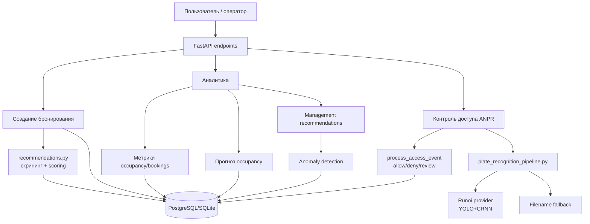
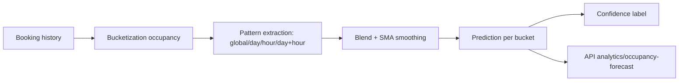
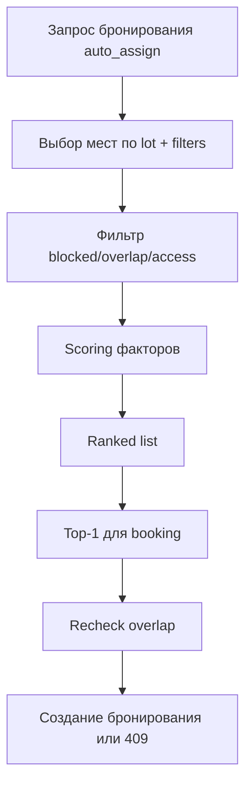
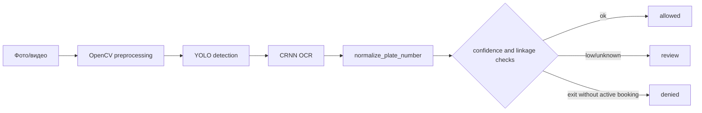
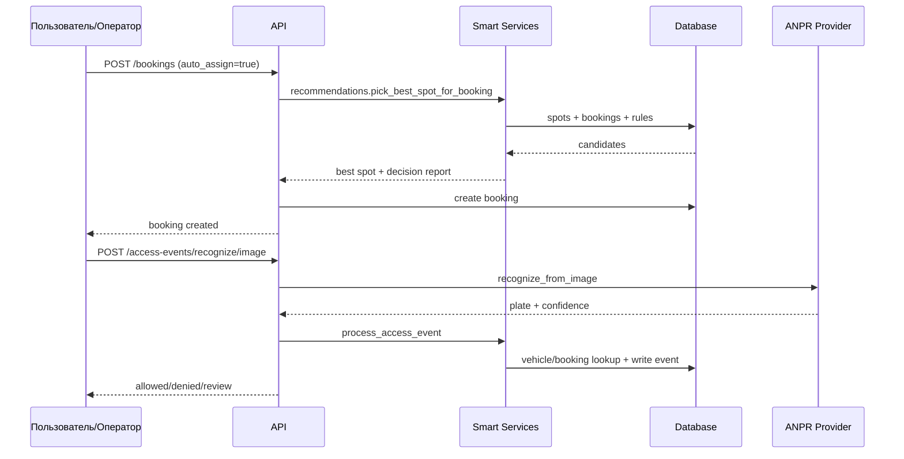

# Умная часть проекта: архитектура, метрики, прогнозирование и распознавание номеров

## 1. Краткое описание
Интеллектуальная часть проекта решает четыре основные задачи: аналитика и метрики загрузки парковки, прогнозирование будущей загрузки, автоподбор парковочного места при бронировании и ANPR-процесс распознавания номера для контроля доступа.

Система строится в основном на explainable/rule-based логике и статистике по историческим данным (а не на «черном ящике» ML для всех задач). При этом в распознавании номеров используется ML-пайплайн (YOLO + CRNN) с fallback-режимом, если модель недоступна.

## 2. Общая архитектура
Основные компоненты:
- API-слой: endpoints `analytics`, `recommendations`, `bookings`, `access-events`.
- Сервисный слой:
  - `app/services/analytics.py` — метрики и прогнозы;
  - `app/services/recommendations.py` — ранжирование и выбор места;
  - `app/services/access_events.py` + `app/services/plate_recognition_pipeline.py` — распознавание и решение по допуску;
  - `app/services/anomaly_detection.py` + `management_recommendations.py` — аномалии и управленческие рекомендации.
- Хранилище: SQLAlchemy-модели `Booking`, `ParkingSpot`, `ParkingZone`, `Vehicle`, `VehicleAccessEvent`, `AuditLog`.



## 3. Источники данных

| Источник данных | Где используется | Какие поля важны | Комментарий |
| --------------- | ---------------- | ---------------- | ----------- |
| `bookings` | Метрики, прогноз, подбор, поиск связанного бронирования | `start_time`, `end_time`, `status`, `parking_spot_id`, `vehicle_id`, `plate_number` | Ключевой факт-сет для «умной» логики |
| `parking_spots` | Occupancy, автоподбор, ограничения | `status`, `spot_type`, `zone_id`, `has_charger`, `vehicle_type`, `size_category` | Определяет пул кандидатов |
| `parking_zones` | Зональная аналитика и доступ | `name`, `access_level` | Влияет на доступ по ролям |
| `vehicles` | Связка номера с пользователем | `plate_number`, `normalized_plate_number`, `is_active`, `user_id` | Используется в access control |
| `vehicle_access_events` | ANPR-аудит, security-аномалии | `normalized_plate_number`, `decision`, `recognition_confidence`, `processing_status` | Источник событий доступа |
| `audit_logs` | Security-метрики/рекомендации | `action_type`, `new_values`, `source_metadata` | Считываются unknown plate сигналы |

## 4. Вычисление метрик
Ключевые метрики реализованы в `app/services/analytics.py` и вызываются из `app/api/v1/endpoints/analytics.py`.

| Метрика | Назначение | Формула / логика | Где считается | Где используется |
| ------- | ---------- | ---------------- | ------------- | ---------------- |
| `occupancy_percent` | Средняя загрузка выбранного контура | Сумма секунд пересечения бронирований с интервалом / `(кол-во мест * длительность интервала)` * 100 | `get_occupancy_percent` | Dashboard, summary, management recommendations |
| `occupancy_by_zone` | Сравнение зон | Аналог occupancy, но по группировке `zone` | `get_occupancy_by_zone` | Аналитика зон, дисбаланс |
| `occupancy_by_spot_type` | Сравнение типов мест | Аналог occupancy, но по `spot_type` | `get_occupancy_by_spot_type` | Аналитика типов |
| `bookings_count` | Объем спроса | Count бронирований в периоде | `get_booking_metrics` | KPI |
| `average_booking_duration_minutes` | Средняя длительность | Avg(`end_time - start_time`) в минутах | `get_booking_metrics` | KPI, аномалии длительности |
| `cancellation_rate` | Доля отмен | `cancelled / total` | `get_booking_metrics` | Рекомендации, аномалии |
| `no_show_rate` | Доля неявок | `no_show / total` | `get_booking_metrics` | Рекомендации, аномалии |
| `peak_hours` | Пиковые часы | Группировка по часу начала бронирования | `get_peak_hours` | UI/операционные решения |

Пример формулы occupancy:

$$
OccupancyPercent = \frac{\sum overlap\_seconds(booking, [from,to])}{N_{spots} \cdot (to-from)_{seconds}} \cdot 100
$$

Пропуски/edge cases:
- Если мест нет, occupancy возвращается как 0 (во избежание деления на 0).
- Поддерживается PostgreSQL и SQLite с разными SQL-выражениями для длительности/пересечений.

## 5. Прогнозирование
Прогноз реализован как explainable статистическая модель в `HistoricalPatternForecastModel`.

| Прогноз | Цель | Входные признаки | Метод | Выход | Файлы / функции |
| ------- | ---- | ---------------- | ----- | ----- | --------------- |
| Occupancy forecast | Предсказать загрузку по бакетам | История бронирований, weekday/hour, window history_days, SMA window | Rule/statistical blend: weekday+hour averages + global average + SMA smoothing | `predicted_occupancy_percent`, `confidence`, `comment`, `samples` | `app/services/analytics.py`: `HistoricalPatternForecastModel.predict`, `_predict_bucket_value` |
| Forecast quality | Оценить точность прогноза | Факт occupancy и backtest-prediction | MAE, MAPE, RMSE | Метрики качества + comparison series | `get_forecast_quality`, `_calculate_forecast_error_metrics` |

Важно: в прогнозе не обнаружена обучаемая ML-модель (fit/train). Это rule-based/statistical forecasting.



## 6. Автоподбор места для бронирования
Алгоритм в `app/services/recommendations.py`, интегрирован в создание бронирования (`auto_assign=true`) через `pick_best_spot_for_booking`.

Основные шаги:
1. Формирование кандидатного пула мест в паркинге (с optional filters).
2. Отсев по hard constraints:
   - место заблокировано;
   - конфликт по времени с blocking-статусами;
   - запрет по роли/уровню доступа;
   - strict charger preference.
3. Расчет multi-factor score.
4. Сортировка и выбор top-N; для брони — top-1.

Скоринговая формула:

```text
score =
 availability*w_availability +
 spot_type*w_spot_type +
 zone*w_zone +
 charger*w_charger +
 role*w_role +
 conflict*w_conflict
```

Weights по умолчанию: `0.35 / 0.15 / 0.10 / 0.10 / 0.20 / 0.10`.

| Критерий | Как влияет на подбор | Вес / приоритет | Где реализован |
| -------- | -------------------- | --------------- | -------------- |
| availability | Базовая доступность кандидата | 0.35 | `_build_score_context` + aggregation |
| spot_type | Предпочитаемые типы | 0.15 | `_spot_type_score` |
| zone | Предпочтительные зоны | 0.10 | `_zone_score` |
| charger | Наличие зарядки | 0.10 | `_charger_score`, `_build_charger_preference_mode` |
| role | Соответствие политике доступа | 0.20 | `_is_spot_allowed_for_role`, `_role_score` |
| conflict | Рядом по времени занятость | 0.10 | `_conflict_score` |

Fallback:
- Если кандидатов нет/все отвергнуты — в booking API возвращается `409 No suitable parking spot...`.
- Дополнительно перед сохранением брони есть recheck конфликта, чтобы учесть race condition.



## 7. Распознавание номеров автомобилей
Реализация распределена между:
- `app/services/plate_recognition_pipeline.py` (оркестрация провайдеров);
- `app/services/anpr/providers/runoi_provider.py` (YOLO+CRNN);
- `app/services/anpr/providers/fallback_provider.py` (fallback);
- `app/services/access_events.py` (принятие access decision);
- `app/services/plate_recognition.py` (нормализация номера).

| Этап | Что происходит | Используемый метод / библиотека | Файлы / функции |
| ---- | -------------- | ------------------------------- | --------------- |
| Ingest | Прием image/video в endpoint | FastAPI UploadFile + media storage | `access_events.py` endpoints |
| Preprocess | Gray/blur/threshold/contours/perspective | OpenCV | `RunoiANPRProvider._preprocess_plate` |
| Detection | Детекция зоны номера | YOLO (ultralytics) | `_recognize_frame` |
| OCR | Распознавание символов | CRNN (PyTorch, quantized model) | `_recognize_crop`, `_decode` |
| Postprocess | Нормализация номера | uppercase/remove separators/cyr->latin map | `normalize_plate_number` |
| Validation/decision | Confidence & business checks | threshold + booking/vehicle linking rules | `process_access_event` |
| Fallback | При ошибке/UNKNOWN провайдера | filename fallback provider | `PlateRecognitionPipeline._recognize` |

Поддержка форматов:
- Явного regex-валидатора формата госномера в коде не найдено.
- Есть нормализация и маппинг кириллица→латиница (`АВЕКМНОРСТУХ`).

Ошибки и confidence:
- low confidence `< settings.anpr_confidence_threshold` → `review`.
- `UNKNOWN` → `review`.
- Для въезда/выезда есть правила `allowed/denied/review` по найденной связи номер↔ТС↔бронь.



## 8. Математический аппарат

| Метод | Где используется | Идея метода | Формула / логика | Ограничения |
| ----- | ---------------- | ----------- | ---------------- | ----------- |
| Overlap-based occupancy | Аналитика загрузки | Интеграл занятости по времени | суммарное пересечение интервалов / емкость*время | Зависит от точности статусов и времени |
| Weighted linear scoring | Автоподбор места | Взвешенная сумма факторов | `score=Σ(w_i*x_i)` | Весы эвристические, не обучаемые |
| Historical pattern forecast | Прогноз | Комбинация средних по паттернам | day+hour, hour, weekday, global + SMA | Нет обучения; чувствительно к смещениям паттерна |
| Error metrics (MAE/MAPE/RMSE) | Оценка прогноза | Backtesting ошибки | стандартные метрики | MAPE нестабилен на малых значениях факта |
| ANPR confidence threshold | Контроль доступа | Порог уверенности OCR/детекции | `if confidence < threshold -> review` | Порог статичен, требует калибровки |

## 9. Потоки данных



## 10. Обработка ошибок и edge cases

| Ситуация | Как обнаруживается | Как обрабатывается | Где реализовано |
| -------- | ------------------ | ------------------ | --------------- |
| Нет доступных мест | Все кандидаты rejected / пустой ranked | 409 при создании бронирования | `bookings.create_booking`, `recommendations.recommend_spots` |
| Некорректный интервал дат | `from >= to` | HTTP 400 | analytics/bookings endpoints |
| Недостаточно данных для прогноза | Нет history spots/bookings | forecast с low confidence / 0.0 | `HistoricalPatternForecastModel.predict` |
| Номер не распознан | `normalized == UNKNOWN` | `review`, уведомление охране | `process_access_event` |
| Низкая уверенность | `confidence < threshold` | `review` | `process_access_event` |
| Конфликт бронирований | overlap query | 409 и отмена создания | `bookings.create_booking` |
| Недоступен ANPR provider | `_init_error` в runoi | fallback provider | `plate_recognition_pipeline.py` |
| Сбой чтения image/video | `imread/cap` fail | error-result и failed processing | runoi provider + endpoint status |

## 11. Где находится код

| Файл / модуль | Назначение | Ключевые функции / классы |
| ------------- | ---------- | ------------------------- |
| `app/services/analytics.py` | Метрики и прогнозы | `get_occupancy_percent`, `get_booking_metrics`, `HistoricalPatternForecastModel`, `get_forecast_quality` |
| `app/services/recommendations.py` | Автоподбор места | `recommend_spots`, `pick_best_spot_for_booking` |
| `app/api/v1/endpoints/bookings.py` | Интеграция автоназначения в бронирование | `create_booking` |
| `app/services/access_events.py` | Решения по доступу и связка с бронированием | `process_recognition_access_event`, `process_access_event` |
| `app/services/plate_recognition_pipeline.py` | Оркестрация ANPR provider/fallback | `recognize_from_image/video`, `build_diagnostics` |
| `app/services/anpr/providers/runoi_provider.py` | ML-распознавание номера | `RunoiANPRProvider` |
| `app/services/plate_recognition.py` | Нормализация номера | `normalize_plate_number` |
| `app/services/anomaly_detection.py` | Выявление аномалий | `AnomalyDetectionService.detect` |
| `app/services/management_recommendations.py` | Рекомендации менеджменту | `ManagementRecommendationsService.list_recommendations` |
| `app/api/v1/endpoints/analytics.py` | API аналитики/прогнозов | `analytics_*` handlers |
| `app/api/v1/endpoints/access_events.py` | API ANPR/control | `recognize_access_event_*` |

## 12. Примеры сценариев
### Сценарий 1: Автоматический подбор места
1. Клиент вызывает создание бронирования с `auto_assign=true`.
2. Сервис рекомендаций строит кандидатный список по паркингу + фильтрам.
3. Отбрасываются blocked/overlap/role-недоступные варианты.
4. Для оставшихся считается multi-factor score.
5. Берется лучший кандидат, повторно проверяется overlap.
6. Бронирование сохраняется, статус места синхронизируется.

### Сценарий 2: Распознавание номера автомобиля
1. Оператор отправляет фото/видео в `/access-events/recognize/*`.
2. Pipeline пытается Runoi provider (YOLO+CRNN).
3. При неуспехе — fallback provider.
4. Номер нормализуется, ищется связанное ТС/бронирование.
5. Формируется решение `allowed/denied/review`.
6. Пишется `VehicleAccessEvent`, при проблемах уходит уведомление охране.

### Сценарий 3: Расчет метрик
1. Запрос `/analytics/summary` или `/analytics/occupancy`.
2. Разрешается период (`day/week/month` или custom from/to).
3. Из БД считаются occupancy, count, average duration, cancellation/no-show.
4. Результаты возвращаются в API и UI.

### Сценарий 4: Прогнозирование
1. Запрос `/analytics/occupancy-forecast` с target window.
2. Берется история (`history_days`) и строятся occupancy buckets.
3. Для каждого будущего бакета считается прогноз по историческим паттернам + SMA.
4. Возвращается прогноз с confidence/comment.

## 13. Ограничения текущей реализации
- Для автоподбора используются фиксированные эвристические веса; нет data-driven калибровки.
- В ANPR нет явной regex-валидации форматов номеров по странам/регионам.
- Confidence threshold единый и статичный.
- Forecast — статистический rule-based, без online learning.
- Часть аналитики чувствительна к качеству данных статусов бронирований и их своевременной синхронизации.
- Не во всех модулях видны расширенные quality-тесты на edge-cases pipeline ANPR/forecast.

## 14. Возможные улучшения
- Автотюнинг весов подбора места по историческим исходам (acceptance, конфликты, удовлетворенность).
- Ввести explainability-лог «почему выбран именно этот slot» в отдельный аналитический журнал.
- Добавить confidence calibration для ANPR и разные пороги по камерам/локациям.
- Реализовать regex/правила валидации номерных форматов и post-OCR correction map.
- Добавить drift-monitoring прогноза и автоматический алерт при деградации MAE/MAPE.
- Добавить A/B тестирование стратегий ранжирования.

## 15. Краткий итог
Интеллектуальный контур проекта основан на связке explainable аналитики, rule-based оптимизации подбора мест и ANPR-контроля доступа с ML-распознаванием номера. Ключевыми модулями являются `analytics.py`, `recommendations.py`, `access_events.py` и ANPR providers. Архитектура уже поддерживает расширяемость: можно заменять модель прогноза, расширять факторы скоринга и подключать новые ANPR-провайдеры.

---

## Финальный служебный вывод
- Проанализированы файлы: API endpoints (`bookings`, `analytics`, `access_events`), сервисы аналитики/рекомендаций/ANPR/аномалий, схемы данных и связанная документация.
- Ключевые модули умной логики: `app/services/analytics.py`, `app/services/recommendations.py`, `app/services/access_events.py`, `app/services/plate_recognition_pipeline.py`, `app/services/anpr/providers/runoi_provider.py`, `app/services/management_recommendations.py`, `app/services/anomaly_detection.py`.
- Документ создан: `docs/smart-system-overview.md`.
- Уверенно описаны: метрики, прогнозный pipeline, алгоритм автоподбора, ANPR pipeline и decision logic.
- Требуют уточнения по коду/данным: полнота валидаторов форматов номеров, качество на реальных датасетах, стратегия калибровки confidence/весов.
